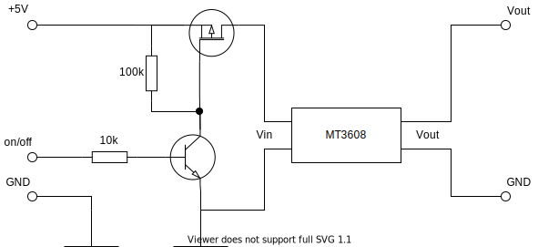

# Fan control
Control external fan by switching GPIO 15 (defined as POWER_PIN in source code). 
Fan with nominal voltage 12V is powered by step-up converter.

## Compilation
g++ -o fancontrol fancontrol.cpp

## Temperature
CPU temperature is read from '/sys/class/thermal/thermal_zone0/temp' file

## Rock Pi 4 connector
ROCK Pi 4 has a 40-pin expansion header.

<table>
<tr>
<th> GPIO number </th>
<th> Function2 </th>
<th> Function1 </th>
<th>  GPIO </th>
<th>  Pin# </th>
<th> </th>
<th> Pin# </th>
<th> GPIO </th>
<th> Function1 </th>
<th> Function2 </th>
<th> GPIO number
</th></tr>
<tr>
<td> </td>
<td> </td>
<td> +3.3V </td>
<td>  </td>
<td style="background:yellow"> 1 </td>
<td>  </td>
<td style="background:red"> 2 </td>
<td>  </td>
<td> +5.0V </td>
<td>  </td>
<td>
</td></tr>
<tr>
<td> 71 </td>
<td> </td>
<td> I2C7_SDA </td>
<td> GPIO2_A7 </td>
<td style="background:green; color:white"> 3 </td>
<td> </td>
<td style="background:red"> 4 </td>
<td> </td>
<td> +5.0V </td>
<td>   </td>
<td>
</td></tr>
<tr>
<td> 72 </td>
<td> </td>
<td> I2C7_SCL </td>
<td> GPIO2_B0 </td>
<td style="background:green; color:white"> 5 </td>
<td> </td>
<td style="background:black; color:white"> 6 </td>
<td>  </td>
<td> GND </td>
<td>   </td>
<td>
</td></tr>
<tr>
<td> 75 </td>
<td> </td>
<td> SPI2_CLK </td>
<td> GPIO2_B3 </td>
<td style="background:green; color:white"> 7 </td>
<td> </td>
<td style="background:green; color:white"> 8 </td>
<td> GPIO4_C4 </td>
<td style="background:orange">UART2_TXD </td>
<td>   </td>
<td> 148
</td></tr>
<tr>
<td> </td>
<td> </td>
<td>  GND </td>
<td>  </td>
<td style="background:black; color:white"> 9 </td>
<td> </td>
<td style="background:green; color:white">10 </td>
<td> GPIO4_C3 </td>
<td style="background:orange">UART2_RXD </td>
<td>   </td>
<td> 147
</td></tr>
<tr>
<td>146  </td>
<td> </td>
<td>  PWM0 </td>
<td> GPIO4_C2 </td>
<td style="background:green; color:white">11 </td>
<td> </td>
<td style="background:green; color:white">12 </td>
<td> GPIO4_A3 </td>
<td> I2S1_SCLK </td>
<td>   </td>
<td> 131
</td></tr>
<tr>
<td> 150 </td>
<td> </td>
<td> PWM1 </td>
<td> GPIO4_C6 </td>
<td style="background:green; color:white">13 </td>
<td>  </td>
<td style="background:black; color:white">14 </td>
<td> </td>
<td> GND </td>
<td>   </td>
<td>
</td></tr>
<tr>
<td> 149 </td>
<td> </td>
<td> SPDIF_TX </td>
<td>  GPIO4_C5 </td>
<td style="background:green; color:white">15 </td>
<td> </td>
<td style="background:green; color:white">16 </td>
<td> GPIO4_D2 </td>
<td> </td>
<td>   </td>
<td> 154
</td></tr>
<tr>
<td> </td>
<td> </td>
<td>  +3.3V </td>
<td> </td>
<td style="background:yellow">17 </td>
<td> </td>
<td style="background:green; color:white">18 </td>
<td> GPIO4_D4 </td>
<td> </td>
<td>   </td>
<td> 156
</td></tr>
<tr>
<td>40 </td>
<td> UART4_TXD </td>
<td style="background:orange">SPI1_TXD </td>
<td> GPIO1_B0 </td>
<td style="background:green; color:white">19 </td>
<td>  </td>
<td style="background:black; color:white">20 </td>
<td> </td>
<td> GND </td>
<td>   </td>
<td>
</td></tr>
<tr>
<td>39 </td>
<td> UART4_RXD </td>
<td style="background:orange">SPI1_RXD </td>
<td> GPIO1_A7  </td>
<td style="background:green; color:white">21  </td>
<td>   </td>
<td style="background:green; color:white">22  </td>
<td> GPIO4_D5  </td>
<td>   </td>
<td> </td>
<td> 157
</td></tr>
<tr>
<td>41 </td>
<td> </td>
<td style="background:orange">SPI1_CLK </td>
<td> GPIO1_B1 </td>
<td style="background:green; color:white">23 </td>
<td>  </td>
<td style="background:green; color:white">24 </td>
<td> GPIO1_B2  </td>
<td style="background:orange">SPI1_CSn  </td>
<td>  </td>
<td> 42
</td></tr>
<tr>
<td> </td>
<td> </td>
<td>  GND  </td>
<td>  </td>
<td style="background:black; color:white">25  </td>
<td>   </td>
<td style="background:green; color:white">26 </td>
<td>  </td>
<td> ADC_IN0 </td>
<td>   </td>
<td>
</td></tr>
<tr>
<td> 64 </td>
<td> </td>
<td>  I2C2_SDA  </td>
<td> GPIO2_A0 </td>
<td style="background:blue; color:white">27  </td>
<td>  </td>
<td style="background:blue; color:white">28 </td>
<td> GPIO2_A1 </td>
<td> I2C2_CLK </td>
<td>  </td>
<td> 65
</td></tr>
<tr>
<td> 74 </td>
<td> I2C6_SCL </td>
<td>  SPI2_TXD  </td>
<td> GPIO2_B2 </td>
<td style="background:green; color:white">29  </td>
<td>  </td>
<td style="background:black; color:white">30 </td>
<td>  </td>
<td> GND </td>
<td>   </td>
<td>
</td></tr>
<tr>
<td> 73 </td>
<td> I2C6_SDA </td>
<td>  SPI2_RXD  </td>
<td> GPIO2_B1 </td>
<td style="background:green; color:white">31  </td>
<td>  </td>
<td style="background:green; color:white">32 </td>
<td> GPIO3_C0 </td>
<td> SPDIF_TX </td>
<td> UART3_CTSn </td>
<td> 112
</td></tr>
<tr>
<td> 76 </td>
<td> </td>
<td>   SPI2_CSn </td>
<td> GPIO2_B4 </td>
<td style="background:green; color:white">33  </td>
<td>  </td>
<td style="background:black; color:white">34 </td>
<td>  </td>
<td> GND </td>
<td>   </td>
<td>
</td></tr>
<tr>
<td> 133 </td>
<td> </td>
<td>   I2S1_LRCK_TX </td>
<td> GPIO4_A5 </td>
<td style="background:green; color:white">35  </td>
<td>  </td>
<td style="background:green; color:white">36 </td>
<td> GPIO4_A4 </td>
<td> I2S1_LRCK_RX </td>
<td>   </td>
<td> 132
</td></tr>
<tr>
<td> 158 </td>
<td> </td>
<td>   </td>
<td> GPIO4_D6 </td>
<td style="background:green; color:white">37  </td>
<td>  </td>
<td style="background:green; color:white">38 </td>
<td> GPIO4_A6 </td>
<td> I2S1_SDI </td>
<td>   </td>
<td> 134
</td></tr>
<tr>
<td> </td>
<td> </td>
<td>   GND </td>
<td>  </td>
<td style="background:black; color:white">39  </td>
<td>  </td>
<td style="background:green; color:white">40  </td>
<td> GPIO4_A7 </td>
<td> I2S1_SDO </td>
<td>   </td>
<td> 135
</td></tr></table>

